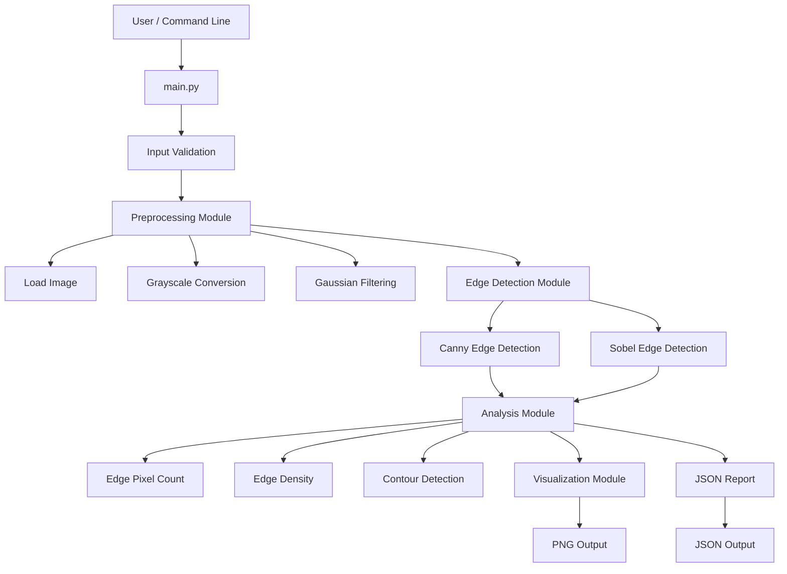
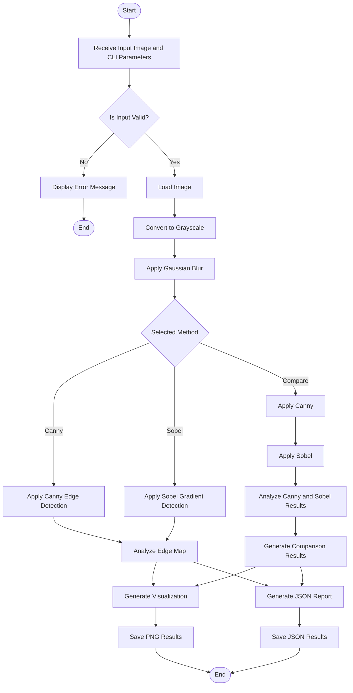
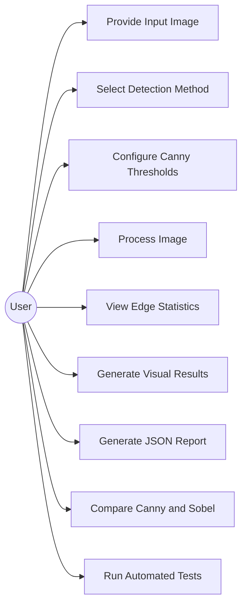
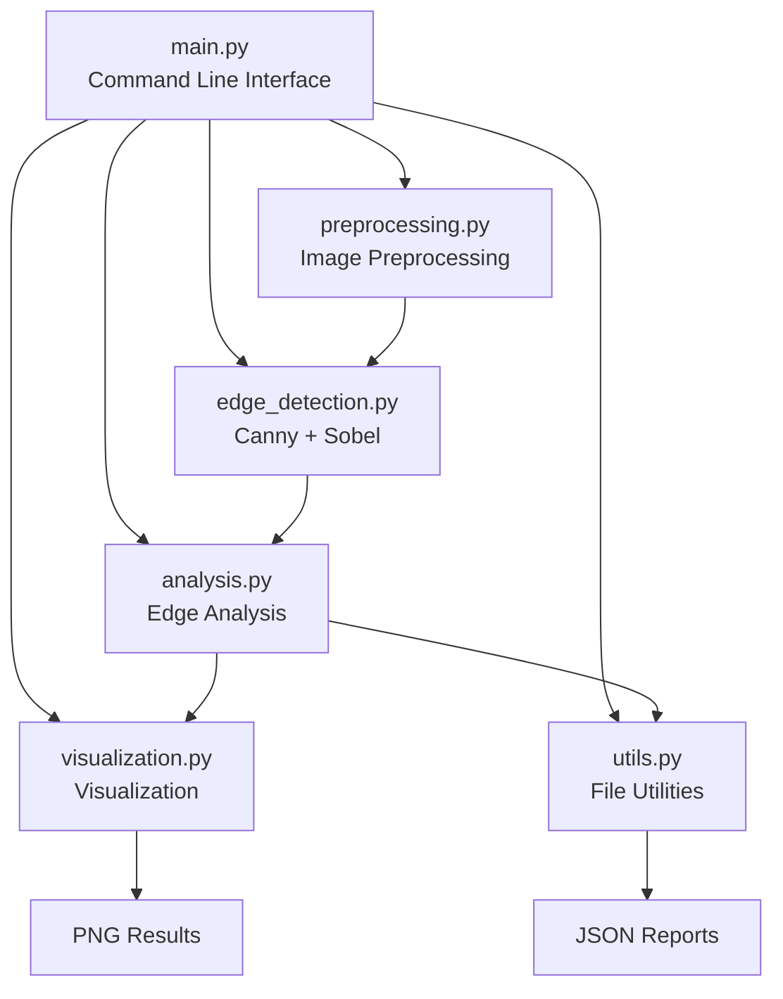
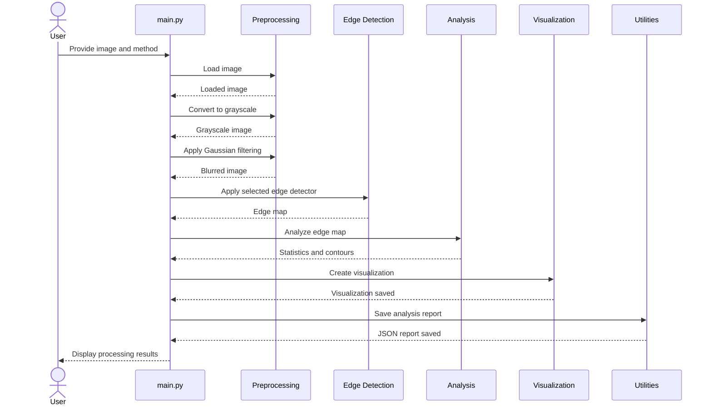
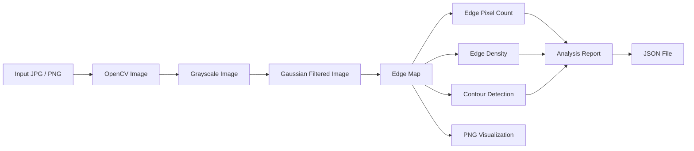

# EdgeVision - Design Diagrams

## 1. System Architecture Diagram

## 2. Process Workflow Diagram

## 3. Use Case Diagram

## 4. Component Diagram

## 5. Sequence Diagram

## 6. Data Flow Diagram

7. Storage Design

EdgeVision does not use a relational database.

The application uses:

Input image files stored in the input/ directory.
Generated visual outputs stored in the output/ directory.
Analysis results stored as JSON files.
No user accounts or persistent database records are required.

Therefore, an ER diagram is not applicable to the current implementation.

8. Module Responsibilities

| Module              | Responsibility                                          |
| ------------------- | ------------------------------------------------------- |
| `main.py`           | Command-line interface and pipeline orchestration       |
| `preprocessing.py`  | Image loading, grayscale conversion, Gaussian filtering |
| `edge_detection.py` | Canny and Sobel edge detection                          |
| `analysis.py`       | Edge statistics and contour detection                   |
| `visualization.py`  | Result and comparison image generation                  |
| `utils.py`          | Directory creation and JSON report generation           |
| `tests/`            | Automated validation of core functionality              |
